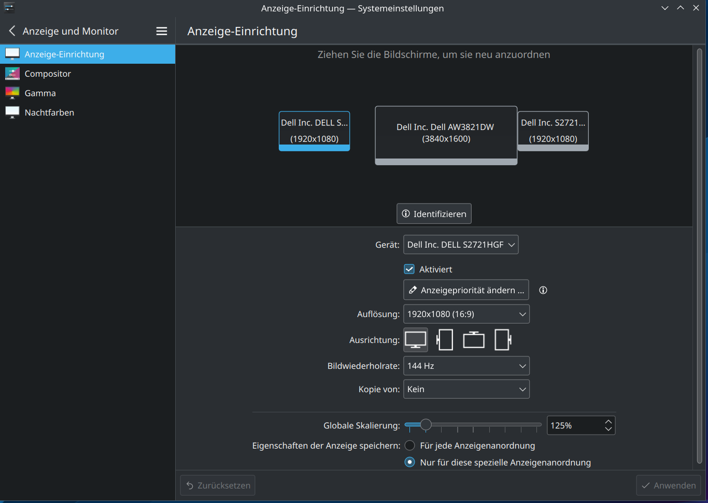

# fix-mouse-jump

**DPI-aware mouse transition fix for multi-monitor setups on Linux/X11.**

Eliminates the "mouse jump" when moving the cursor between monitors with different resolutions or DPI values. This is the Linux equivalent of [LittleBigMouse](https://github.com/mgth/LittleBigMouse) for Windows.

Includes a **KDE kscreen UI patch** that fixes the false "gap" warning in KDE display settings and shows monitors correctly bottom-aligned — exactly like the real physical setup.

## The Problem

When using monitors with different resolutions (e.g., a 4K/UWQHD center monitor with 1080p side monitors), moving the mouse across screen boundaries causes a jarring position jump. The mouse enters the adjacent screen at the wrong vertical position because X11 maps pixels 1:1 regardless of physical monitor size.

```
Without fix-mouse-jump:          With fix-mouse-jump:

 ┌──────┐┌──────────────┐         ┌──────┐┌──────────────┐
 │      ││              │         │      ││              │
 │ 1080p ││    UWQHD    │         │ 1080p ││    UWQHD    │
 │      ││              │         │      ││              │
 │  ──→ ││ ↑ JUMP!      │         │  ──→ ││→  smooth!    │
 └──────┘│              │         └──────┘│              │
         └──────────────┘                  └──────────────┘
```

Additionally, KDE's display settings (kscreen2) cannot understand xrandr scaling. It shows a false **"Lücken zwischen Anzeigen werden nicht unterstützt"** (gaps between displays) warning and renders monitor positions incorrectly. This tool fixes that too.

## How It Works

### Mouse Jump Fix

The tool uses `xrandr --scale` to virtually increase the resolution of lower-DPI monitors, so their pixel density matches the higher-DPI center monitor. This makes mouse transitions physically accurate.

The scale factor is calculated from the physical pixel densities:

```
center_ppmm = center_height_px / center_height_mm   (e.g., 1600 / 370 = 4.32)
side_ppmm   = side_height_px   / side_height_mm     (e.g., 1080 / 336 = 3.21)
SCALE       = center_ppmm / side_ppmm               (e.g., 4.32 / 3.21 = 1.35)
```

With `SCALE=1.35`, the 1920×1080 side monitors are virtually upscaled to 2592×1458. This matches the pixel density of the UWQHD center monitor — mouse transitions become seamless.

### KDE Display Settings Fix

When xrandr scaling is applied, KDE's kscreen2 sees the X11 geometry (scaled positions and native sizes) and thinks there are gaps between monitors:

```
What kscreen2 sees (WRONG):
  DP-0: size 1920×1080, position x=0      → ends at x=1920
  DP-4: size 3840×1600, position x=2592   → gap of 672px!
  DP-2: size 1920×1080, position x=6432   → gap of 672px!
```

The fix has two parts:

1. **`sync_kscreen()`** — Writes native (unscaled) monitor positions to the kscreen2 config file after plasmashell restart, so monitors appear side-by-side:
   ```
   DP-0: pos 0×520     (1920px wide, bottom-aligned)
   DP-4: pos 1920×0    (right after DP-0)
   DP-2: pos 5760×520  (right after DP-4, bottom-aligned)
   ```

2. **QML UI Patch** — Overrides KDE's display settings UI (`~/.local/share/kpackage/kcms/kcm_kscreen/`):
   - **`main.qml`**: Suppresses the false `ConfigHasGaps` warning
   - **`Screen.qml`**: Recalculates monitor positions using native sizes, producing a gap-free layout
   - **`Output.qml`**: Uses the corrected positions for rendering each monitor rectangle

## Requirements

- Linux with X11 (not Wayland)
- KDE Plasma 5 (for plasmashell restart + kscreen patch)
- `xrandr`
- `bash` ≥ 4.0
- `awk`
- `jq` (for kscreen config patching)

## Installation

```bash
git clone https://github.com/brainAThome/fix-mouse-jump.git
cd fix-mouse-jump
chmod +x install.sh
./install.sh
```

Then edit the config to match your monitor setup:

```bash
nano ~/.config/fix-mouse-jump/config
```

### What gets installed

| Component | Location | Purpose |
|-----------|----------|---------|
| Main script | `~/.local/bin/fix-mouse-jump` | xrandr scaling + kscreen sync |
| Config | `~/.config/fix-mouse-jump/config` | Monitor names, resolutions, scale |
| Autostart | `~/.config/autostart/fix-mouse-jump.desktop` | Auto-apply at login |
| KDE UI patch | `~/.local/share/kpackage/kcms/kcm_kscreen/contents/ui/` | Fix display settings UI |
| Logs | `~/.local/share/fix-mouse-jump/` | Runtime log file |

## Configuration

### Finding Your Monitor Setup

```bash
xrandr --query | grep " connected"
```

Example output:
```
DP-0 connected 1920x1080+0+520 597mm x 336mm
DP-4 connected primary 3840x1600+1920+0 880mm x 370mm
DP-2 connected 1920x1080+5760+520 597mm x 336mm
```

### Calculating the Scale Factor

```bash
# From the xrandr output above:
# Center monitor: 1600px height, 370mm physical height
# Side monitors:  1080px height, 336mm physical height

python3 -c "print(f'SCALE = {(1600/370) / (1080/336):.2f}')"
# Output: SCALE = 1.35
```

### Config File (`~/.config/fix-mouse-jump/config`)

```bash
# ─── Monitor Output Names ───────────────────────────────────────────────────
LEFT_MONITOR="DP-0"
CENTER_MONITOR="DP-4"
RIGHT_MONITOR="DP-2"

# ─── Native Resolutions ─────────────────────────────────────────────────────
LEFT_RES="1920x1080"
CENTER_RES="3840x1600"
RIGHT_RES="1920x1080"

# ─── Refresh Rates (Hz) ─────────────────────────────────────────────────────
LEFT_RATE="144"
CENTER_RATE="144"
RIGHT_RATE="144"

# ─── Scale Factor ────────────────────────────────────────────────────────────
SCALE="1.35"

# ─── Autostart Settings ─────────────────────────────────────────────────────
AUTOSTART_DELAY=10       # Wait for kscreen2 before first apply
AUTOSTART_REAPPLY_DELAY=20  # Re-apply after kscreen2 may reset layout

# ─── Plasmashell ─────────────────────────────────────────────────────────────
RESTART_PLASMASHELL=true   # Restart plasmashell (fixes wallpaper rendering)
```

## Usage

```bash
# Apply the fix (scaling + plasmashell restart + kscreen sync)
fix-mouse-jump apply

# Revert to original layout (no scaling)
fix-mouse-jump revert

# Show current monitor status
fix-mouse-jump status

# Show help
fix-mouse-jump help
```

The fix is automatically applied at login via the autostart entry.

### How `apply` Works (Step by Step)

1. **`apply_scale`** — Sets xrandr scaling on side monitors + positions all monitors bottom-aligned
2. **`restart_plasmashell`** — Restarts plasmashell (fixes wallpaper rendering on scaled monitors)
3. **Wait 3 seconds** — Lets kscreen2 finish writing its config after plasmashell restart
4. **`sync_kscreen`** — Patches the kscreen2 config with native positions (gap-free)

### How `autostart` Works

1. Wait `AUTOSTART_DELAY` seconds (default: 10) for kscreen2 to finish initial setup
2. Apply scaling + restart plasmashell + sync kscreen
3. Wait `AUTOSTART_REAPPLY_DELAY` seconds (default: 20) in case kscreen2 resets the layout
4. Re-apply scaling + re-sync kscreen

## Uninstall

```bash
./uninstall.sh
```

This reverts the monitor layout, removes the script, autostart entry, KDE UI patches, and logs. Config is kept unless you confirm deletion.

## Project Structure

```
fix-mouse-jump/
├── fix-mouse-jump          # Main script (bash)
├── config.example          # Example configuration
├── install.sh              # Installer
├── uninstall.sh            # Uninstaller
├── kscreen-patch/          # KDE display settings UI fix
│   └── contents/ui/
│       ├── main.qml        # Suppresses ConfigHasGaps warning
│       ├── Output.qml      # Uses corrected positions for rendering
│       └── Screen.qml      # Recalculates gap-free layout
├── README.md
└── LICENSE
```

## How the KDE UI Patch Works

KDE Plasma 5's display settings KCM (`kcm_kscreen`) reads monitor geometry from the X11 backend via `kscreen-doctor`. When xrandr scaling is active, the X11 positions are inflated (e.g., a 1920px-wide monitor at scale 1.35 occupies 2592px in X space), but `model.size` still reports the native resolution. This mismatch creates visual gaps in the UI.

The QML patch fixes this by:

1. **`Screen.qml`** — Adds a `recalcPositions()` function that:
   - Collects all enabled outputs with their X11 positions and native sizes
   - Sorts them left-to-right by X11 position
   - Rebuilds positions using cumulative native widths (gap-free)
   - Bottom-aligns shorter monitors relative to the tallest

2. **`Output.qml`** — Each monitor delegate:
   - Exposes `modelPosition` and `modelSize` properties for `Screen.qml` to read
   - Uses `displayPos` (corrected position from `Screen.qml`) instead of raw `model.position`

3. **`main.qml`** — The `onInvalidConfig` handler:
   - Still shows the warning for `NoEnabledOutputs` (all monitors disabled)
   - Ignores `ConfigHasGaps` (false positive from xrandr scaling)

The patches are installed as local KPackage overrides in `~/.local/share/kpackage/kcms/kcm_kscreen/`, which KDE loads before the system-wide files in `/usr/share/`. No `sudo` or system file modifications needed.

> **Note**: After KDE/kscreen system updates, the patched QML files may become outdated. Re-run `./install.sh` to re-apply the patches from the latest originals.

## Known Limitations

- **X11 only** — On Wayland, per-monitor scaling is handled natively by the compositor (no fix needed).
- **KDE Plasma 5 only** — The QML patch targets KDE Plasma 5's `kcm_kscreen`. Plasma 6 (expected in Kubuntu 26.04 LTS) handles per-monitor scaling natively.
- **Don't click "Apply" in KDE display settings** — This would override the xrandr layout. Run `fix-mouse-jump apply` again to restore.
- **Text size** — Side monitors show slightly smaller text due to the virtual resolution increase. This is expected and matches the physical DPI.
- **System updates** — KDE updates may overwrite the QML patch base files. Re-run `./install.sh` after updates.

## Tested Setup

| Monitor | Model | Resolution | Refresh Rate | Physical Size |
|---------|-------|-----------|-------------|---------------|
| Left | Dell S2721HGF (27") | 1920×1080 | 144 Hz | 597mm × 336mm |
| Center | Dell AW3821DW (38") | 3840×1600 | 144 Hz | 880mm × 370mm |
| Right | Dell S2721HGFA (27") | 1920×1080 | 144 Hz | 597mm × 336mm |

**System**: Ubuntu 24.04 LTS, KDE Plasma 5.27.12, X11, NVIDIA RTX 4080 (driver 590.48.01)

## Alternatives

- **[LittleBigMouse](https://github.com/mgth/LittleBigMouse)** — Windows equivalent (inspiration for this project)
- **Wayland** — Native per-monitor scaling (but may have app compatibility issues)
- **KDE Plasma 6** — Native per-monitor DPI support on X11 (Kubuntu 26.04 LTS, April 2026)

## License

[GPL-3.0](LICENSE)
